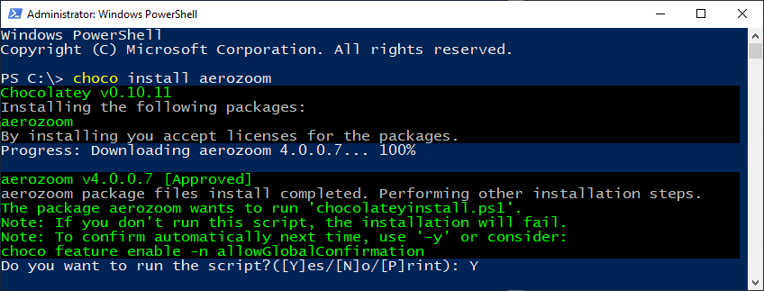

# How-to: Create a Silent Installer with AutoHotkey and Publish it on Chocolatey

Supposed there is a portable Windows application without an installer and uninstaller, how to create them back? In today's post, we will explore one way to build a `Setup.exe` using AutoHotkey (AHK), with additional compression of 7-Zip applied to the `Setup.exe` and remaining files of the portable application for maximum compression, and then wrap it with an outer unattended installer, which is suitable for certain deployments.

The application example, i.e. the application for which a setup is created is [AeroZoom](https://tech.wandersick.com/p/aerozoom-for-windows-7-magnifier.html). While some terminologies are specific to AeroZoom, the general concepts should apply to other software.

```c
// ⭐1️⃣ to be built: outer unattended installer written in AHK

AeroZoom_Unattended_Installer.exe
    │
    │   // 2️⃣ to be built: 7-Zip self-extracting archive
    │
    └───AeroZoom_7-Zip_SFX.exe
          │
          ├───AeroZoom // portable app example
          │
          │      AeroZoom.exe
          │      ...
          │
          │      // ⭐3️⃣ to be built: inner setup written in AHK
          │
          │      Setup.exe
          │
          └───Data
```

1. `AeroZoom_Unattended_Installer.exe` will be the outer unattended installer we will write in [AutoHotkey](https://autohotkey.com) (AHK) language, which contains 7-Zip SFX `AeroZoom_7-Zip_SFX.exe` and is responsible for extraction as well as calling an inner `Setup.exe` to install AeroZoom for all users silently

2. The second-level `AeroZoom_7-Zip_SFX.exe` will be our [7-Zip](https://www.7-zip.org/) self-extracting archive (SFX). It contains the portable application files of AeroZoom and the inner `Setup.exe`
   - Use of a 7-Zip SFX automatically provides silent extraction parameters for the outer `AeroZoom_Unattended_Installer.exe` to leverage
   - The SFX will be zipped with the ultra compression option to effectively reduce the size of AeroZoom from 32MB to 2MB in the case of AeroZoom which contains multiple similar executables

3. The third-level `Setup.exe`, the inner setup, is the second AutoHotkey program we will write which provides installations parameters for the outer `AeroZoom_Unattended_Installer.exe` which can be leveraged e.g. by `choco install` command of Chocolatey, uninstallation parameters for `choco uninstall`, as well as logic to determine several things such as whether AeroZoom has already been installed, which will be detailed in the last section

After walking through how to create `AeroZoom_7-Zip_SFX.exe` and `AeroZoom_Unattended_Installer.exe` (goal #1), we will take a detour to go through how to push this unattended installer to the community repository of [Chocolatey](https://chocolatey.org) (goal #2), the package manager for Windows, before going back to detailing how to create the inner `Setup.exe` (goal #3).



This how-to will be centered around our code repository on GitHub:

 - https://github.com/wandersick/az-autohotkey-silent-setup

### Table of Content

  - [1. Step-by-Step: Building Outer Unattended Installer Using AutoHotkey](#1-step-by-step-building-outer-unattended-installer-using-autohotkey) (Goal #1)
    - [About False-Positive Notices from Anti-virus Software](#about-false-positive-notices-from-anti-virus-software)
  - [2. Pushing Unattended Installer to Chocolatey](#2-pushing-unattended-installer-to-chocolatey) (Goal #2)
  - [3. Step-by-Step: Building Inner Setup Using AutoHotkey](#3-step-by-step-building-inner-setup-using-autohotkey) (Goal #3)
    - [How It Works](#how-it-works)

Let's go and create all those exe files above!

### Some Trivia of AeroZoom (before We Begin)

> Scripted in AHK, [AeroZoom](https://tech.wandersick.com/p/aerozoom-for-windows-7-magnifier.html) enhances upon Windows Magnifier and optionally Sysinternals ZoomIt to enable screen magnification by mouse-wheeling, as well as turning any mouse into a Home-Theater PC/presentation mouse, where zooming and positioning becomes a breeze without a keyboard.

Originally, AeroZoom was built as a portable application. Its `Setup.exe` was introduced in a later version, `v2.0`, and the unattended setup `AeroZoom_Unattended_Installer.exe`, the first outcome of this article, was introduced in `v4.0`.

## 1. Step-by-Step: Building Outer Unattended Installer Using AutoHotkey

This first section walks through how to create the outer unattended installer, `AeroZoom_Unattended_Installer.exe`, written in AutoHotkey:

1. In Command Prompt, download or [git](https://git-scm.com/downloads) clone [our code repository](https://github.com/wandersick/az-autohotkey-silent-setup) to a desired directory e.g. `c:\az-autohotkey-silent-setup`

   ```batch
   cd /d c:
   git clone https://github.com/wandersick/az-autohotkey-silent-setup.git
   ```

    So that the following folder structure is acquired

   ```c
   C:\az-autohotkey-silent-setup
   │   ...
   │
   │   // AHK code of the outer unattended installer to be customized
   │
   │   AeroZoom_Unattended_Installer.ahk
   │
   │   // optional: for use with Compile_AHK II (alternative compiler)
   │
   └───AeroZoom_Unattended_Installer.ahk.ini
   ```

2. Download [AeroZoom](https://tech.wandersick.com/p/aerozoom-for-windows-7-magnifier.html) and extract it to a desired directory, e.g. `C:\AeroZoom`

   ```c
   C:\AeroZoom
   │   AeroZoom.exe
   │   Readme.txt
   │   Setup.exe
   │
   └───Data
   ```

3. Build an inner `Setup.exe` using AutoHotkey following [these instructions in the third and final section](#Building-and-Obtaining-Inner-Setupexe-using-AutoHotkey) to learn the process, or leave it as is for now and learn how to build it later (recommended for now)

    - Ensure `Setup.exe` is next to AeroZoom

   ```c
   C:\AeroZoom
   │   AeroZoom.exe
   │   Readme.txt
   │
   │   // if you manually build this Setup.exe, replace existing one
   │   // otherwise, no action is required
   │
   │   Setup.exe
   │
   └───Data
   ```

4. Package (compress) the above `C:\AeroZoom` application directory in a [7-Zip SFX (self-extracting archive)](https://www.wikihow.com/Use-7Zip-to-Create-Self-Extracting-excutables)

   - Optionally, this step can be skipped by leveraging the AeroZoom download, which already comes with an SFX `AeroZoom_v4.0.0.7_beta_2.exe` after extraction

   - Put the SFX file there and rename it as `AeroZoom_7-Zip_SFX.exe`

   ```c
   C:\az-autohotkey-silent-setup
   │   AeroZoom_Unattended_Installer.ahk
   │   AeroZoom_Unattended_Installer.ahk.ini
   │   README.md
   │   ...
   │
   │   // place SFX (containing C:\AeroZoom) built using 7-Zip here
   │
   └───AeroZoom_7-Zip_SFX.exe
   ```

5. Place an icon named `AeroZoom_Setup.ico` there (optional)

   ```c
   C:\az-autohotkey-silent-setup
   │   AeroZoom_7-Zip_SFX.exe
   │   AeroZoom_Unattended_Installer.ahk
   │   AeroZoom_Unattended_Installer.ahk.ini
   │   README.md
   │   ...
   │
   │   // optionally, place an icon here
   │
   └───AeroZoom_Setup.ico
   ```

6. Edit [AeroZoom_Unattended_Installer.ahk](https://github.com/wandersick/az-autohotkey-silent-setup/blob/master/AeroZoom_Unattended_Installer.ahk) and change below `C:\az-autohotkey-silent-setup\AeroZoom_7-Zip_SFX.exe` to a desired location (no change if directory is the same as the example)

As shown below, the AutoHotkey source code of `AeroZoom_Unattended_Installer.exe` is relatively simple. It only contains three lines (excluding comments):

   ```ahk
   ; Package an application (e.g. AeroZoom) in 7-Zip SFX
   ; (FYI: the AeroZoom download already comes with an SFX)
   ; Place it in the location specified below
   ; e.g. C:\az-autohotkey-silent-setup\AeroZoom_7-Zip_SFX.exe

   FileInstall, C:\az-autohotkey-silent-setup\AeroZoom_7-Zip_SFX.exe, %A_ScriptDir%\AeroZoom_7-Zip_SFX.exe, 1

   ; Silently extract AeroZoom from SFX into the current folder

   RunWait, %A_ScriptDir%\AeroZoom_7-Zip_SFX.exe -o"%A_ScriptDir%" -y

   ; Run silent setup command: Setup.exe /programfiles /unattendaz=1
   ; For AeroZoom, thse parameters will perform installation:
   ; - silently (/unattendedaz=1)
   ; - to All Users (/programfiles)
   ; Or uninstall in case AeroZoom is found in the target folder
   ; (built into the logic of Setup.exe of AeroZoom)

   RunWait, %A_ScriptDir%\AeroZoom\Setup.exe /programfiles /unattendaz=1
   ```

7. [Download and install AutoHotKey](https://autohotkey.com)

8. While under repository directory (e.g. `C:\az-autohotkey-silent-setup`), compile `AeroZoom_Unattended_Installer.ahk` using the bundled AHk2Exe utility, usually located under `C:\Program Files\AutoHotkey\Compiler` as so:

    - `"C:\Program Files\AutoHotkey\Compiler\Ahk2Exe.exe" /in "AeroZoom_Unattended_Installer.ahk" /icon "AeroZoom_Setup.ico"`
      - Icon parameter is optional: `/icon "AeroZoom_Setup.ico"`
    - Alternatively, to compile with the alternative compiler, download and install [Compile_AHK II](https://www.autohotkey.com/board/topic/21189-compile-ahk-ii-for-those-who-compile/), then right-click `AeroZoom_Unattended_Installer.ahk` and select _Compile with Options_ which would parse parameters from [AeroZoom_Unattended_Installer.ahk.ini](https://github.com/wandersick/az-autohotkey-silent-setup/blob/master/AeroZoom_Unattended_Installer.ahk.ini)
      - While Compile_AHK II comes with compression feature, this article uses 7-Zip as 7-Zip reduces the file size much better (from 32MB to 2MB) in our case

9.  Done. Now executing `AeroZoom_Unattended_Installer.exe` would silently trigger an extraction of 7-Zip SFX `AeroZoom_7-Zip_SFX.exe` and calls the inner AeroZoom `Setup.exe` to install AeroZoom for all users with its unattended installation parameter `/programfiles /unattendAZ=1` (which will be further explained in the third and final section)

**Goal #1**: The end result, `AeroZoom_Unattended_Installer.exe`, is available for [download here](https://github.com/wandersick/aerozoom/releases/tag/4.0.2) (as `AeroZoom_v4.0.0.7_beta_2_silent_installer.exe`).

### About False-Positive Notices from Anti-virus Software

Like certain AutoHotkey applications, some anti-virus vendors may falsely identify the unattended installer created as undesirable. It is understandable considering the nature of this application is to perform installation and uninstallation in a silent way, which involves seemingly risky tasks such as modifying uninstallation keys in the registry.

On the other hand, I found that compiling using Compile_AHK II and/or an icon helps lower the detection rates a little bit (from [12](https://www.virustotal.com/gui/file/e8cf2094a562a5b7010edecb8bdcb11f15ea95ab21bf3ce27e7e58426c3bcf6a/detection) down to [<10](https://www.virustotal.com/gui/file/015da23376e29da9e7501eaaf9c501fbfd3fce87e5604cd09fbe4cd191537c27/detection) out of 65 anti-virus applications on VirusTotal).

Still, this false-positive detection issue may not be completely eliminated and can be safely ignored. It is recommended to [report your file to your anti-virus vendor as clean if possible](https://www.techsupportalert.com/content/how-report-malware-or-false-positives-multiple-antivirus-vendors.htm).

## 2. Pushing Unattended Installer to Chocolatey

Thanks to this [Chocolatey how-to article by Coffmans](https://medium.com/@coffmans/my-own-chocolatey-package-for-dessert-f7721b7fe234) and [guidance from Chocolatey](https://chocolatey.org/docs/create-packages), I was able to figure out how to push the outer unattended installer to the [Chocolatey community repository here](https://chocolatey.org/packages/aerozoom).

The Chocolatey package specification files customized for AeroZoom have been included in the [git repository](https://github.com/wandersick/az-autohotkey-silent-setup) downloaded in step #1 of the above section which was initially created with `choco new <package name>` command after Chocolatey has been [downloaded and installed](https://chocolatey.org/docs/installation) on a supported Windows machine.

Let's walk through the folder structure:

```c
C:\az-autohotkey-silent-setup\Chocolatey\AeroZoom
│   ReadMe.md
│   _TODO.txt
│   ...
│
│   // 1️⃣ package metadata
│
│   aerozoom.nuspec
│
└───tools

        // 2️⃣ tasks run before [un]install scripts

        chocolateybeforemodify.ps1

        // 3️⃣ edited Chocolatey install script
        //    (for use with 'choco install')

        chocolateyinstall.ps1

        // 4️⃣ edited Chocolatey uninstall script
        //    (for use with: 'choco uninstall')

        chocolateyuninstall.ps1
```

1. [aerozoom.nuspec](https://github.com/wandersick/az-autohotkey-silent-setup/blob/master/Chocolatey/AeroZoom/aerozoom.nuspec) contains the below self-describing package metadata (click the hyperlink to see the AeroZoom example with comments)
   - id
   - version
   - packageSourceUrl
   - owners
   - title
   - authors
   - projectUrl
   - iconUrl
   - licenseUrl
   - requireLicenseAcceptance
   - projectSourceUrl
   - docsUrl
   - mailingListUrl
   - bugTrackerUrl
   - tags
   - summary
   - description
   - releaseNotes

2. [chocolateybeforemodify.ps1](https://github.com/wandersick/az-autohotkey-silent-setup/blob/master/Chocolatey/AeroZoom/tools/chocolateybeforemodify.ps1) performs pre-checks prior to installation and uninstallation. For example, to prevent running processes from conflicting with setup, we can use PowerShell cmdlet `Stop-Process` to forcefully terminate processes

- It is important to add `-ErrorAction SilentlyContinue` so that users do not see error texts when the command runs without any process to stop

    ```ps1
    Stop-Process -ProcessName aerozoom* -Force -ErrorAction SilentlyContinue
    ```

3. [chocolateyinstall.ps1](https://github.com/wandersick/az-autohotkey-silent-setup/blob/master/Chocolatey/AeroZoom/tools/chocolateyinstall.ps1) performs silent installation by downloading and using an unattended installer, which is the outcome from the first section of this article. It should be hosted on a publicly accessible web server in order for this Chocolatey installation script to leverage

    ```ps1
    $url = 'https://github.com/wandersick/aerozoom/releases/download/4.0.2/AeroZoom_v4.0.0.7_beta_2_silent_installer.exe'
    ```

4. [chocolateyuninstall.ps1](https://github.com/wandersick/az-autohotkey-silent-setup/blob/master/Chocolatey/AeroZoom/tools/chocolateyuninstall.ps1) performs silent uninstallation by using a parameter specific to the application installer, which is `/programfiles /unattendAZ=1` in the case of AeroZoom. (The parameters will be further explained in the third and final section)

    ```ps1
    silentArgs    = "/programfiles /unattendAZ=1"
    ```

One AeroZoom-specific side-note:

- Due to the way `Setup.exe` of AeroZoom works, for `chocolateyuninstall.ps1`, I have added `Substring` (from PowerShell) to remove `/programfiles /unattendAZ=2` from `UninstallString` (in Windows registry), replacing it with `/programfiles /unattendAZ=1` from `$silentArgs` (in `chocolateyuninstall.ps1`). Otherwise, uninstallation would not be performed in an unattended way

  ```powershell
  $packageArgs['file'] = "$($_.UninstallString)".Substring(0, $_.UninstallString.IndexOf(' /'))
  ```

Once the PowerShell scripts have been edited, below are the commands for packaging, testing (installing and uninstalling), as well as pushing to the Chocolatey community repository

```powershell
# create NuGet package (aerozoom.4.0.0.7.nupkg)
# ensure current directory is correct

cd az-autohotkey-silent-setup\Chocolatey\AeroZoom
choco pack

# install aerozoom.4.0.0.7.nupkg by running:
# - chocolateybeforemodify.ps1
# - chocolateyinstall.ps1

choco install aerozoom.4.0.0.7.nupkg

# uninstall aerozoom by running:
# - chocolateybeforemodify.ps1
# - chocolateyuninstall.ps1

choco uninstall aerozoom

# push to community repo (--api-key required)

choco push aerozoom.4.0.0.7.nupkg
```

**Goal #2**: Having gone through the [moderation review process](https://chocolatey.org/faq#how-does-the-moderation-review-process-work), AeroZoom is available on [Chocolatey community repository](https://twitter.com/wandersick/status/1154727225268174848) now.

## 3. Step-by-Step: Building Inner Setup Using AutoHotkey

This final section walks through how to create the inner `Setup.exe` acquired after 7-Zip extraction.

The steps for building the `Setup.exe` would be:

1. First, let's delete `Setup.exe` in the AeroZoom folder

    If not already done so, the files below can be [downloaded here](https://tech.wandersick.com/p/aerozoom-for-windows-7-magnifier.html) and extracted to a desired directory, e.g. `C:\AeroZoom`

    ```c
    C:\AeroZoom
    │   AeroZoom.exe
    │   Readme.txt
    │   ...
    │
    │   // Setup.exe will be built using below method here
    │
    └───Data
    ```

2. Acquire the source code of `Setup.exe`, i.e. [Setup.ahk](https://github.com/wandersick/az-autohotkey-silent-setup/blob/master/Setup.ahk)

    If not already done so, open Command Prompt, download or `git clone` [our code repository](https://github.com/wandersick/az-autohotkey-silent-setup) to a desired directory e.g. `c:\az-autohotkey-silent-setup`

    ```batch
    cd /d c:
    git clone https://github.com/wandersick/az-autohotkey-silent-setup.git
    ```

    So that the following folder structure is acquired

    ```c
    C:\az-autohotkey-silent-setup
    │   Setup.ahk.ini
    │   ...
    │
    │   // source code of Setup.exe of AeroZoom
    │
    └───Setup.ahk
    ```

3. If not already done so, [download and install AutoHotKey](https://autohotkey.com)

4. While under repository directory (e.g. `C:\az-autohotkey-silent-setup`), compile `Setup.ahk` using the bundled AHk2Exe utility, usually located under `C:\Program Files\AutoHotkey\Compiler` as follows:

   - `"C:\Program Files\AutoHotkey\Compiler\Ahk2Exe.exe" /in "Setup.ahk" /icon "AeroZoom_Setup.ico"`
     - Icon parameter is optional: `/icon "AeroZoom_Setup.ico"`
   - Alternatively, to compile with the alternative compiler, download and install [Compile_AHK II](https://www.autohotkey.com/board/topic/21189-compile-ahk-ii-for-those-who-compile/), then right-click `Setup.ahk` and select _Compile with Options_, which would parse parameters from [Setup.ahk.ini](https://github.com/wandersick/az-autohotkey-silent-setup/blob/master/Setup.ahk.ini)
     - While Compile_AHK II comes with compression feature, this post uses 7-Zip as 7-Zip reduces the file size much better (from 32MB to 2MB) for our case

5. Done
  
**Goal #3**: The end result, `Setup.exe`, can be used to install and uninstall AeroZoom, provided that it is located in the below directory, and that suitable unattended installation parameters are passed (see `Setup.exe /?`), or the installation is performed in an normal attended way (i.e. double-clicking the `Setup.exe` and follow the on-screen installation instructions).

```c
C:\AeroZoom
│   AeroZoom.exe
│   Readme.txt
│   ...
│
│   // Place the newly created Setup.exe in this folder
│   // It can install and uninstall AeroZoom here
│   Setup.exe
│
└───Data
```

If you would like, you may also continue from step 3 of the first section to leverage this newly created `Setup.exe` to create the outer unattended installer again, which enables a totally silent installation experience of AeroZoom without the need to supply any parameters.

### How It Works

Instead of using a popular approach such as Windows Installer, AeroZoom implements `Setup.exe` from the ground up, which has its own parameters:

- `/programfiles` for installing into `C:\Program Files (x86)` (or `C:\Program Files` for 32-bit OS) instead of current user profile, i.e. `%localappdata%`, usually `C:\Users\{username}\AppData\Local`
- `/unattendAZ=1` for an unattended installation

If it detects AeroZoom is already installed, the setup will perform an uninstallation instead

- If `/unattendAZ=2` or any other values, an uninstallation dialog box will also be prompted

```ahk
targetDir=%localappdata%
If %1% {
  
  ; For each parameter

  Loop, %0%
  {
    ; Retrieve A_Index variable contents

    param := %A_Index%
    If (param="/unattendAZ=1")
      unattendAZ=1
    Else if (param="/unattendAZ=2")
      unattendAZ=2
    Else if (param="/programfiles")
    {
      targetDir=%programfiles%
      setupAllUsers=1
    }
    Else
    {
      Msgbox, 262192, AeroZoom Setup, Supported parameters:`n`n - Unattended setup : /unattendAZ=1`n - Install for all users : /programfiles`n`nFor example: Setup.exe /programfiles /unattendaz=1`n`nNote:`n - If setup finds a copy in the target location, uninstallation will be carried out instead.`n - If you install into Program Files folder, be sure you're running it with administrator rights.
      ExitApp, 5
    }
  }
}
```

During installation or uninstallation, `Setup.exe` would first check a few prerequisites, such as whether files it depends on exist or not, as well as terminating any executables that could be running.

Once it is OK to proceed with installation, `Setup.exe` would create shortcuts:

```ahk
IfExist, %targetDir%\wandersick\AeroZoom\AeroZoom.exe
{
  ; Create shortcut to Start Menu (All Users)

  If setupAllUsers
  {
    FileCreateShortcut, %targetDir%\wandersick\AeroZoom\AeroZoom.exe, %A_ProgramsCommon%\AeroZoom.lnk, %targetDir%\wandersick\AeroZoom\,, AeroZoom`, the smooth wheel-zooming and snipping mouse-enhancing panel,,
    FileCreateShortcut, %targetDir%\wandersick\AeroZoom\AeroZoom.exe, %A_DesktopCommon%\AeroZoom.lnk, %targetDir%\wandersick\AeroZoom\,, AeroZoom`, the smooth wheel-zooming and snipping mouse-enhancing panel,,
  }
  ; Create shortcut to Start Menu (Current User)

  Else
  {
    FileCreateShortcut, %targetDir%\wandersick\AeroZoom\AeroZoom.exe, %A_Programs%\AeroZoom.lnk, %targetDir%\wandersick\AeroZoom\,, AeroZoom`, the smooth wheel-zooming and snipping mouse-enhancing panel,,
    FileCreateShortcut, %targetDir%\wandersick\AeroZoom\AeroZoom.exe, %A_Desktop%\AeroZoom.lnk, %targetDir%\wandersick\AeroZoom\,, AeroZoom`, the smooth wheel-zooming and snipping mouse-enhancing panel,,
  }
}
```

Next, `Setup.exe` would write uninstallation information such as `UninstallString` to the Windows Registry:

```ahk
If setupAllUsers
{
  ; If AeroZoom was installed for all users
  
  RegWrite, REG_SZ, HKEY_CURRENT_USER, %regKey%, UninstallString, %targetDir%\wandersick\AeroZoom\Setup.exe /unattendAZ=2 /programfiles
}
Else
{
  ; If AeroZoom was installed for current user

  RegWrite, REG_SZ, HKEY_CURRENT_USER, %regKey%, UninstallString, %targetDir%\wandersick\AeroZoom\Setup.exe /unattendAZ=2
}
```

Other information it writes there are:

- Publisher
- DisplayVersion
- InstallLocation
- URLInfoAbout
- HelpLink
- InstallDate
- DisplayName
- DisplayIcon
- EstimatedSize

Regarding uninstallation, it is simply the above process in reverse, i.e. deleting shortcuts and removing the registry entries.

One thing worth mentioning is previous version of AeroZoom installer (`v4.0` and before) would leave `Setup.exe` under the installation directory. Since `v5.0`, this has been solved by calling a minimized `cmd.exe /c` to `ping localhost` followed by the self-destruction, in order for `Setup.exe` to delete itself.

```ahk
; Remove directory content including Setup.exe that is running
; after 3 seconds using ping in a minimized Command Prompt

Run, cmd /c start /min ping 127.0.0.1 -n 3 >nul & rd /s /q "%targetDir%\wandersick"
```

That's it.

For simplicity, only the essential parts of `Setup.exe` are described above. Things that are specific to AeroZoom (e.g. removing scheduled tasks that AeroZoom may have created if specified by user) are not mentioned. For the rest, please refer to the comments in the [source code file](https://github.com/wandersick/az-autohotkey-silent-setup/blob/master/Setup.ahk) `Setup.ahk` and the comments inside.

It would be my pleasure if you find this article informative. Welcome to [comment](https://wandersick.blogspot.com/2019/07/how-to-create-silent-installer-with.html) if you have any question or suggestion. Have a nice day!
